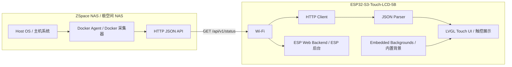

# Architecture / 系统架构

中文：系统分成两端。NAS 端 Docker Agent 负责采集和规整数据；ESP32-S3 端只负责联网、拉取 API、解析 JSON、触控切页和显示。

English: The system has two sides. The NAS Docker Agent collects and normalizes telemetry. The ESP32-S3 firmware connects to Wi-Fi, polls the API, parses JSON, and renders touch pages.

## NAS Side / NAS 端

中文：

- FastAPI 提供 `/api/v1/health` 和 `/api/v1/status`。
- 采集器通过 nsenter 借道宿主机 namespace，从 `/proc`、`/sys`、`df`、`lsblk`、`smartctl`、`mdadm`、Docker socket 读取数据。
- 零挂载架构（pid:host + privileged:true），无需在极空间上 mount 任何主机卷。
- 采集失败不会导致整个接口失败；失败字段进入 `unavailable` 数组。
- 默认只读，不提供任何 HTTP 写操作。
- 默认不启用 token 认证。

English:

- FastAPI exposes `/api/v1/health` and `/api/v1/status`.
- Collectors use nsenter to read from `/proc`, `/sys`, `df`, `lsblk`, `smartctl`, `mdadm`, and Docker socket through the host namespace.
- Zero-mount architecture (pid:host + privileged:true) — no host volume mounts required on ZSpace.
- Collector failures do not fail the whole endpoint; failed fields are reported in `unavailable`.
- The API is read-only and exposes no write operations.
- Token authentication is disabled by default.

## Firmware Side / 固件端

中文：

- `board_5b.c` 初始化 RGB LCD、GT911 触控、CH422G 背光。
- `wifi_manager.c` 连接 Wi-Fi。
- `api_client.c` 拉取 NAS Agent JSON。
- `nas_status.c` 解析共享 API 契约字段。
- `ui.c` 使用 LVGL v8.4 绘制彩色手绘风 7 页界面，Header 带页码圆点指示器，左右滑动切页，并按 NVS 映射渲染 1-7 号内置背景。
- `web_server.c` 在 ESP 上提供 Web 后台，用于配置 NAS 主机名/IP、端口、可选 token、轮询间隔和页面背景，并通过 `/api/test` 从 ESP 侧测试 NAS Agent 健康接口。

English:

- `board_5b.c` initializes RGB LCD, GT911 touch, and CH422G backlight.
- `wifi_manager.c` connects to Wi-Fi.
- `api_client.c` fetches NAS Agent JSON.
- `nas_status.c` parses the shared API contract.
- `ui.c` renders a colorful hand-drawn 7-page LVGL v8.4 UI with header page dots and left/right swipe navigation, using the NVS mapping to apply embedded backgrounds 1-7.
- `web_server.c` exposes an ESP-hosted Web backend for NAS hostname/IP, port, optional token, polling interval, and page backgrounds, and tests the NAS Agent health endpoint from the ESP side through `/api/test`.

## Data Flow / 数据流

| Step | 中文 | English |
| --- | --- | --- |
| 1 | Docker Agent 每次请求时通过 nsenter 读取或缓存 NAS 指标 | The Docker Agent reads or caches NAS metrics per request via nsenter |
| 2 | Agent 输出统一 JSON | The Agent emits normalized JSON |
| 3 | ESP 按配置间隔请求 `/api/v1/status` | ESP polls `/api/v1/status` at the configured interval |
| 4 | ESP 解析字段到固定大小结构体 | ESP parses fields into fixed-size structs |
| 5 | LVGL 根据触控切页刷新卡片 | LVGL refreshes cards and pages based on touch navigation |
| 6 | 浏览器访问 ESP Web 后台修改连接配置，配置写入 NVS | Browser changes connection settings through the ESP Web backend, persisted to NVS |
| 7 | Web 后台的连接测试由 ESP 请求 NAS Agent `/api/v1/health` | The Web backend connection test has the ESP request NAS Agent `/api/v1/health` |
| 8 | 浏览器可在 1-7 号内置背景之间调整每页映射，配置写入 NVS 并立即刷新 UI | Browser can remap each page across embedded backgrounds 1-7; the mapping is persisted to NVS and refreshes the UI immediately |

## Reliability Rules / 可靠性规则

中文：

- API 字段保持向后兼容，新字段只追加。
- ESP 固件对缺失字段显示 `--` 或 `unknown`。
- SMART 和 NVMe 数据可缓存，避免高频访问硬盘。
- ESP 端不直接 SSH 或访问 NAS 系统命令。
- Agent 不挂载任何主机卷，零侵入。

English:

- API fields remain backward compatible; new fields are additive.
- ESP displays `--` or `unknown` for missing fields.
- SMART and NVMe data can be cached to avoid frequent disk access.
- ESP never SSHs into the NAS or runs host commands directly.
- The Agent mounts zero host volumes — zero intrusion.
