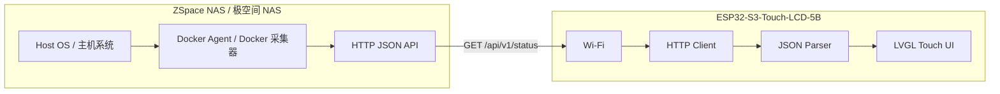

# Architecture / 系统架构

中文：系统分成两端。NAS 端 Docker Agent 负责采集和规整数据；ESP32-S3 端只负责联网、拉取 API、解析 JSON、触控切页和显示。

English: The system has two sides. The NAS Docker Agent collects and normalizes telemetry. The ESP32-S3 firmware connects to Wi-Fi, polls the API, parses JSON, and renders touch pages.

## NAS Side / NAS 端

中文：

- FastAPI 提供 `/api/v1/health` 和 `/api/v1/status`。
- 采集器从 `/proc`、`/sys`、`df`、`lsblk`、`smartctl`、`mdadm`、`sensors`、Docker socket 读取数据。
- 采集失败不会导致整个接口失败；失败字段进入 `unavailable` 数组。
- 默认只读，不提供任何 HTTP 写操作。

English:

- FastAPI exposes `/api/v1/health` and `/api/v1/status`.
- Collectors read from `/proc`, `/sys`, `df`, `lsblk`, `smartctl`, `mdadm`, `sensors`, and the Docker socket.
- Collector failures do not fail the whole endpoint; failed fields are reported in `unavailable`.
- The API is read-only and exposes no write operations.

## Firmware Side / 固件端

中文：

- `board_5b.c` 初始化 RGB LCD、GT911 触控、CH422G 背光。
- `wifi_manager.c` 连接 Wi-Fi。
- `api_client.c` 拉取 NAS Agent JSON。
- `nas_status.c` 解析共享 API 契约字段。
- `ui.c` 使用 LVGL 绘制彩色手绘风格分页界面。

English:

- `board_5b.c` initializes RGB LCD, GT911 touch, and CH422G backlight.
- `wifi_manager.c` connects to Wi-Fi.
- `api_client.c` fetches NAS Agent JSON.
- `nas_status.c` parses the shared API contract.
- `ui.c` renders a colorful hand-drawn LVGL page set.

## Data Flow / 数据流

| Step | 中文 | English |
| --- | --- | --- |
| 1 | Docker Agent 每次请求时读取或缓存 NAS 指标 | The Docker Agent reads or caches NAS metrics per request |
| 2 | Agent 输出统一 JSON | The Agent emits normalized JSON |
| 3 | ESP 每隔数秒请求 `/api/v1/status` | ESP polls `/api/v1/status` every few seconds |
| 4 | ESP 解析字段到固定大小结构体 | ESP parses fields into fixed-size structs |
| 5 | LVGL 根据触控切页刷新卡片 | LVGL refreshes cards and pages based on touch navigation |

## Reliability Rules / 可靠性规则

中文：

- API 字段保持向后兼容，新字段只追加。
- ESP 固件对缺失字段显示 `--` 或 `unknown`。
- SMART 和 NVMe 数据可缓存，避免高频访问硬盘。
- ESP 端不直接 SSH 或访问 NAS 系统命令。

English:

- API fields remain backward compatible; new fields are additive.
- ESP displays `--` or `unknown` for missing fields.
- SMART and NVMe data can be cached to avoid frequent disk access.
- ESP never SSHs into the NAS or runs host commands directly.
